# study-on-typescript

# tsconfig.json


### include
<p>o include é as pastas onde o tsc deve procurar para encontrar seus arquivos typescript</p>

### lib
<p>representa que tipo que o tsc deve executar seu codigo</p>

### molude
<p>para qual sistema de module que o tsc deve compilar o seu codigo</p>

## hello world

````typescript

let mensagem: string = 'hello world';// definindo a variavel e o tipo dela

console.log(mensagem);
````

## utilizando function e chamando-a

````typescript
function addnumber(numb1 : number, numb2 : number)
{
    return numb1 + numb2;
}
console.log(addnumber(1,1));
````

### typeof

<p> para saber que tipo de dados está querendo saber</p>

````ts
console.log('HEXADECIMAL...:', typeof (numb2));
````


## Exemplos de como usar number em ts

````ts
let numb1:number = 23.0;
let numb2:number = 0x78CF;
let numb3:number = 0o577;
let numb4:number = 0b110001;

console.log('NUMBER - Ponto Flutuante...:', numb1);
console.log('HEXADECIMAL...:', numb2);
console.log('OCTAL...:', numb3);
console.log('BINARIO...:', numb4);
````

### Saida


## BIGINT


<p>para sinalizar que é um numero grande, todo final do conteudo vai um (n) para indicar que é um bigint</p>

````ts
let numbBig1:bigint = 9007199254740991n;
let numbBig2:bigint = 0x78CFn;
let numbBig3:bigint = 0o577n;
let numbBig4:bigint = 0b110001n;

console.log('NUMBER - Ponto Flutuante...:', numbBig1);
console.log('HEXADECIMAL...:', numbBig2);
console.log('OCTAL...:', numbBig3);
console.log('BINARIO...:', numbBig4);
````


<p>bigInt é diferente de number, eles sao tipos primitios que lidam com numeros 
completamentes distintos, por exemplo se for uma aplicação que lida com valores
você irá utilizar o bigInt, e se não for numeros não tão expressivos você irá
utilizar o number</p>

## UTILIZANDO STRING 

````ts
let nomePessoa : string = 'felipe';
let nomecompleto : string = `Seja bem vindo ${nomePessoa}`;
console.log(nomecompleto);
````


## UTILIZANDO ARRAY'S

````ts
let frutas:Array<string> = ['maça','banana','abacaxi'];

console.log(frutas);
````


### push

<p>ele inseri um novo elemento no fim da array</p>

````ts
let idiomas: Array<string> = ['portugues','ingles','espanhol','frances'];

idiomas.push('mandarim');

console.log(idiomas);
````


### VER O TAMANHO DA ARRAY

````ts
let idiomas: Array<string> = ['portugues','ingles','espanhol','frances'];

console.log(idiomas.length);
````


### spread operator

````ts
let listaNumeros: Array<number> = [0,1,2,3,4,5];
listaNumeros = [...listaNumeros,6,7,8,9];
````


## UTILIZANDO FUNCTION E FOR

````ts
let linguagem: Array<string> = ['python','php','ts','c#'];

function funcaoLinguagem(linguagens:Array<string>) {
    for (let i = 0; i < linguagens.length; i++) {
        console.log(linguagens[i]);
    }
}

funcaoLinguagem(linguagem);
````


## UTILIZANDO TUPLAS

````ts
let pessoa1: [string, string, number];
pessoa1 = ['felipe', 'mateus', 26];
console.log(pessoa1);
````


## TUPLAS COM LABELS

````ts
let pessoa1: [nome:string, sobrenome:string, idade:number] = ['felipe', 'mateus', 26];
````


## SPREAD OPERATOR COM TUPLAS

````ts
let listaFrutas: [string, ...string[]] = ['maça','banana','abacaxi'];
console.log(...listaFrutas);
````


## TUPLAS COM FUNÇÕES

````ts
function listarPessoas(nomes: string[],idades:number[]):(string | number)[] {
    return [...nomes, ...idades];
}
let resultado = listarPessoas(['felipe','regina'],[26,19]);

console.log(resultado);
````


## LABELED TUPLES COM SPREAD OPERATOR NUMA FUNÇÃO

````ts
type Nome = | [primeiroNome: string, sobrenome:string]
    | [primeiroNome: string, nomeMeio:string ,sobrenome:string];

function criarPessoa(...nome:Nome){
    return [...nome];
}

console.log(criarPessoa('felipe','mateus'));
````


## ENUMS


````ts
enum Idioma {
    Portugues,
    Espanhol,
    Ingles,
    Frances
}
console.log(Idioma);
````


````ts
enum Idioma {
    Portugues = 'PT-BR',
    Espanhol = 'ES',
    Ingles = 'EN',
    Frances = 'FR'
}
console.log(Idioma.Portugues);
````


### EXEMPLO 2

````ts
enum Tarefa {
    Todo,
    Progress,
    Done,
}

const concluidaTarefa = {
    id : 1,
    status: Tarefa.Done,
    descricao: 'Parabens! Tarefa concluida com sucesso!',
};

if (concluidaTarefa.status === Tarefa.Done) {
    console.log('Enviar e-mail: Tarefa Concluida!');
}
````


## ANY EM TS


<p>o certo é saber quando usar o any, ao utilizar ele de qualquer jeito pode acontecer varios poblemas
como este no exemplo acima, quando voce não coloca um tipo para sua variavel, ele vai vir como padrão any</p>

````ts
const formulario: {[campoFormulario:string]:any} = {
    nome: 'felipe',
    sobrenome: 'mateus',
    idade: 26,
}

console.log(formulario.campoFormulario);
````


## unknown

<p>Se não souber qual tipo colocar o melhor 
é colocar unknown</p>


<p>nunca atribua o valor unknown algo que ja tem uma inferencia de outro tipo </p> 

<p>isso pode dar erro. exemplo abaixo</p>

````ts
let valor: unknown;

let valor1: boolean = valor;

console.log(valor1);

````


### diferença entre unknown e any

````ts
let algumacoisaAny: any;
let algumacoisaUnknown: unknown;

console.log(algumacoisaAny.toFixed(2));
console.log(algumacoisaUnknown.toFixed(2));
````

<p>Como mostrado na imagem abaixo somente o unknown esta mostrando que contem erro, 
ja o any não, por que ele nao vai te mostrar um erro em tempo de execução</p>


## VOID EM TS


### exemplos


````ts
function logError(errorMessage:string) {
    console.log(errorMessage);
    // return errorMessage;
}
logError('Required field - name!');

// segunda forma
const logErrorExample2 = (errorMessage : string) => {
    console.log(errorMessage);
}
logErrorExample2('Required field - SurName!');
````

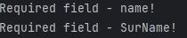

### uso do void em variaveis

<p>quando desativamos o strictNullChecks podemos 
fazer atribuições de variaveis em um valor null em um tipo void</p>

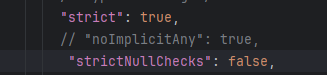

````ts
let variavelExemploVoid: void;
variavelExemploVoid = 1; //error
variavelExemploVoid = null;
variavelExemploVoid = undefined;

console.log(variavelExemploVoid);
````

## NULL E UNDEFINED EM TS

### NULL


### UNDEFINED


### DIFERENÇA ENTRE ELES


#### null

````ts
let variavelTestNull = null;
console.log(variavelTestNull);
console.log(typeof variavelTestNull);
````
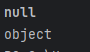

#### undefined

````ts
let variavelTesteUndefied;
console.log(variavelTesteUndefied);
console.log(typeof variavelTesteUndefied);
````
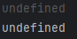

#### diferença entre os 2

````ts
// == compara resultado, === compara valor e o tipo
// console.log('exemplo 1:', null == undefined);
// console.log('exemplo 2:', null === undefined);
````
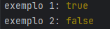

## NEVER EM TS


````ts
function error(message:string) : never {
    throw new Error(message);
}
console.log(error('erro de mensagem'));

function rejectMessage() : never {
    return error('Error de mensagem - 02');
}

console.log(rejectMessage());

const loopInfinity = function loop(){
    while (true){
        console.log('oi');
    }
};

console.log(loopInfinity());
````

## OBJECT EM TS

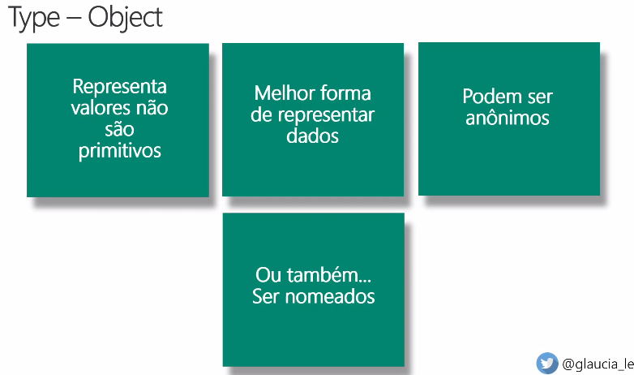

````ts
const pessoa12 = {
    nome: 'felipe',
    sobrenome: 'mateus',
    idade: 26,
    funcao: 'developer php',
}

function onboarding01(funcionario: { nome:string }) : string {
    return 'seja bem vindo ' + funcionario.nome;
}

console.log(onboarding01({nome:' felipe mateus'}));
````

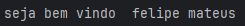

#### utilizando interface com Objeto

````ts
interface Pessoa {
    nome: string;
    funcao: string;
}

function onboarding02(pessoa:Pessoa): string {
    return (
        'Seja bem vindo: ' + pessoa.nome + ' sua funcao aqui na empresa sera: ' + pessoa.funcao
    )
}

console.log(onboarding02({nome: 'felipe',funcao:'developer php'}));
````
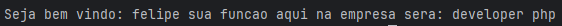

#### utilizando type com Object

````ts
type Pessoa03 = {
    nome: string;
    funcao: string;
    linguagem:string;
};

function onboarding03(pessoa:Pessoa03): string {
    return (
        'Seja bem vindo: ' + pessoa.nome + ' sua funcao aqui na empresa sera: '
        + pessoa.funcao + ' voce trabalhara com a linguagem :' + pessoa.linguagem
    )
}

console.log(onboarding03({nome: 'felipe',funcao:'developer php', linguagem:'php'}));
````
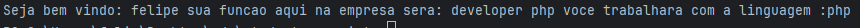

#### propriedade opcional (?:)

````ts
interface Pessoa04 {
 nome: string;
 funcao: string;
 linguagem:string;
 email?:string;
}

function onboarding04(pessoa:Pessoa04): string {
    return (
        'Seja bem vindo: ' + pessoa.nome + ' sua funcao aqui na empresa sera: '
        + pessoa.funcao + ' voce trabalhara com a linguagem :' + pessoa.linguagem
    )
}

console.log(onboarding04({nome: 'felipe',funcao:'developer php', 
    linguagem:'php',email:'dsadas'}));
````

## HERANÇAS EM TYPESCRIPT

````ts
interface Mae{
    nome:string;
}

interface Pai{
    sobrenome:string;
}

interface Filho extends Mae, Pai{
    idade:number;
}

const filho: Filho = {
    nome: 'Felipe',
    sobrenome: 'Mateus',
    idade:26
}

console.log(filho);
````

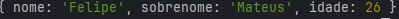

## GENERICS IN TS

````ts
type Usuario = {
    nome: string;
    email:string;
}

type Admin = {
    nome: string;
    email: string;
    admin: true;
}

const usuario: Usuario = {
    nome: 'Felipe',
    email: 'fe@gmail.com'
}

const admin: Admin = {
    nome: 'Felipe',
    email: 'fe@gmail.com',
    admin: true
}

function acessarSistema<T>(usuario:T):T{
    return usuario;
}

console.log(acessarSistema<Usuario>(usuario));
console.log(acessarSistema<Admin>(admin));
````

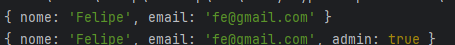