# study-on-typescript

# tsconfig.json

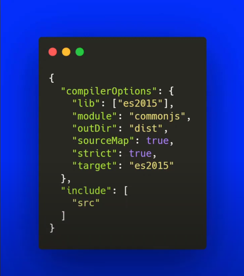

### include
<p>o include é as pastas onde o tsc deve procurar para encontrar seus arquivos typescript</p>

### lib
<p>representa que tipo que o tsc deve executar seu codigo</p>

### molude
<p>para qual sistema de module que o tsc deve compilar o seu codigo</p>

## hello wordl

````typescript

let mensagem: string = 'hello wordl';// definindo a variavel e o tipo dela

console.log(mensagem);
````

## utilizando function e chamando-a

````typescript
function addnumber(numb1 : number, numb2 : number)
{
    return numb1 + numb2;
}
console.log(addnumber(1,1));
````

### typeof

<p> para saber que tipo de dados está querendo saber</p>

````ts
console.log('HEXADECIMAL...:', typeof (numb2));
````

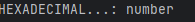

## Exemplos de como usar number em ts

````ts
let numb1:number = 23.0;
let numb2:number = 0x78CF;
let numb3:number = 0o577;
let numb4:number = 0b110001;

console.log('NUMBER - Ponto Flutuante...:', numb1);
console.log('HEXADECIMAL...:', numb2);
console.log('OCTAL...:', numb3);
console.log('BINARIO...:', numb4);
````

### Saida

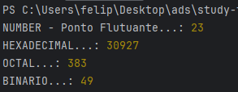

## BIGINT

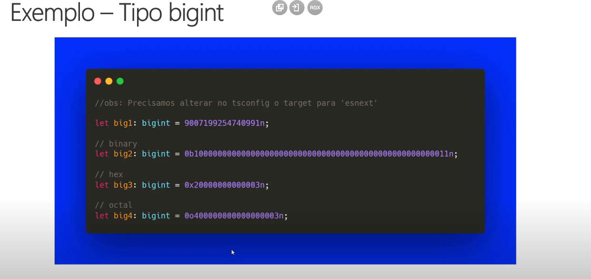

<p>para sinalizar que é um numero grande, todo final do conteudo vai um (n) para indicar que é um bigint</p>

````ts
let numbBig1:bigint = 9007199254740991n;
let numbBig2:bigint = 0x78CFn;
let numbBig3:bigint = 0o577n;
let numbBig4:bigint = 0b110001n;

console.log('NUMBER - Ponto Flutuante...:', numbBig1);
console.log('HEXADECIMAL...:', numbBig2);
console.log('OCTAL...:', numbBig3);
console.log('BINARIO...:', numbBig4);
````

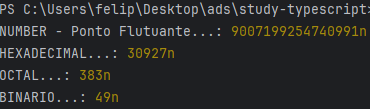

<p>bigInt é diferente de number, eles sao tipos primitios que lidam com numeros 
completamentes distintos, por exemplo se for uma aplicação que lida com valores
você irá utilizar o bigInt, e se não for numeros não tão expressivos você irá
utilizar o number</p>

## UTILIZANDO STRING 

````ts
let nomePessoa : string = 'felipe';
let nomecompleto : string = `Seja bem vindo ${nomePessoa}`;
console.log(nomecompleto);
````

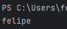

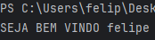

## UTILIZANDO ARRAY'S

````ts
let frutas:Array<string> = ['maça','banana','abacaxi'];

console.log(frutas);
````


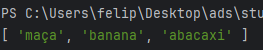

### push

<p>ele inseri um novo elemento no fim da array</p>

````ts
let idiomas: Array<string> = ['portugues','ingles','espanhol','frances'];

idiomas.push('mandarim');

console.log(idiomas);
````

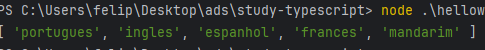

### VER O TAMANHO DA ARRAY

````ts
let idiomas: Array<string> = ['portugues','ingles','espanhol','frances'];

console.log(idiomas.length);
````

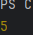

### spread operator

````ts
let listaNumeros: Array<number> = [0,1,2,3,4,5];
listaNumeros = [...listaNumeros,6,7,8,9];
````

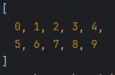

## UTILIZANDO FUNCTION E FOR

````ts
let linguagem: Array<string> = ['python','php','ts','c#'];

function funcaoLinguagem(linguagens:Array<string>) {
    for (let i = 0; i < linguagens.length; i++) {
        console.log(linguagens[i]);
    }
}

funcaoLinguagem(linguagem);
````
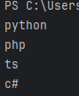

## UTILIZANDO TUPLAS

````ts
let pessoa1: [string, string, number];
pessoa1 = ['felipe', 'mateus', 26];
console.log(pessoa1);
````

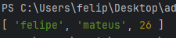

## TUPLAS COM LABELS

````ts
let pessoa1: [nome:string, sobrenome:string, idade:number] = ['felipe', 'mateus', 26];
````

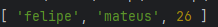

## SPREAD OPERATOR COM TUPLAS

````ts
let listaFrutas: [string, ...string[]] = ['maça','banana','abacaxi'];
console.log(...listaFrutas);
````

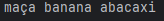

## TUPLAS COM FUNÇÕES

````ts
function listarPessoas(nomes: string[],idades:number[]):(string | number)[] {
    return [...nomes, ...idades];
}
let resultado = listarPessoas(['felipe','regina'],[26,19]);

console.log(resultado);
````

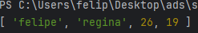

## LABELED TUPLES COM SPREAD OPERATOR NUMA FUNÇÃO

````ts
type Nome = | [primeiroNome: string, sobrenome:string]
    | [primeiroNome: string, nomeMeio:string ,sobrenome:string];

function criarPessoa(...nome:Nome){
    return [...nome];
}

console.log(criarPessoa('felipe','mateus'));
````

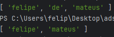

## ENUMS

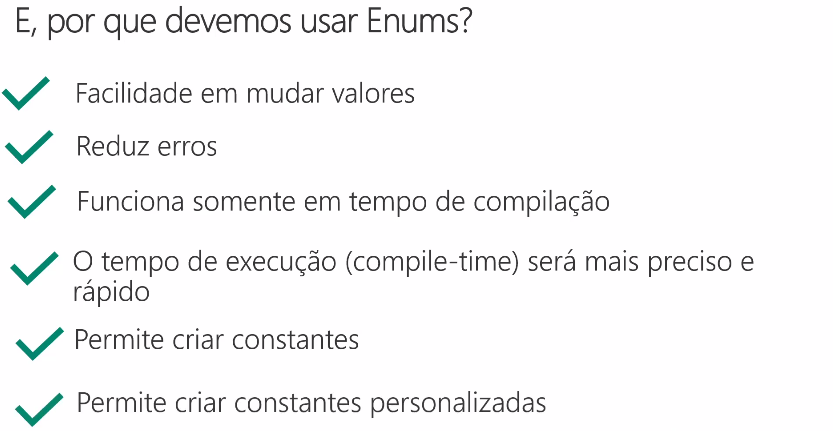

````ts
enum Idioma {
    Portugues,
    Espanhol,
    Ingles,
    Frances
}
console.log(Idioma);
````

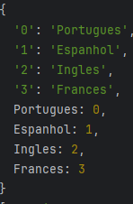

````ts
enum Idioma {
    Portugues = 'PT-BR',
    Espanhol = 'ES',
    Ingles = 'EN',
    Frances = 'FR'
}
console.log(Idioma.Portugues);
````

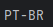

### EXEMPLO 2

````ts
enum Tarefa {
    Todo,
    Progress,
    Done,
}

const concluidaTarefa = {
    id : 1,
    status: Tarefa.Done,
    descricao: 'Parabens! Tarefa concluida com sucesso!',
};

if (concluidaTarefa.status === Tarefa.Done) {
    console.log('Enviar e-mail: Tarefa Concluida!');
}
````
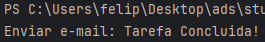

## ANY EM TS

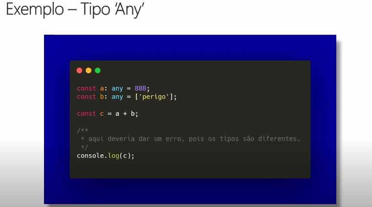

<p>o certo é saber quando usar o any, ao utilizar ele de qualquer jeito pode acontecer varios poblemas
como este no exemplo acima, quando voce não coloca um tipo para sua variavel, ele vai vir como padrão any</p>

````ts
const formulario: {[campoFormulario:string]:any} = {
    nome: 'felipe',
    sobrenome: 'mateus',
    idade: 26,
}

console.log(formulario.campoFormulario);
````
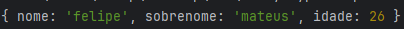

## unknown

<p>Se não souber qual tipo colocar o melhor 
é colocar unknown</p>

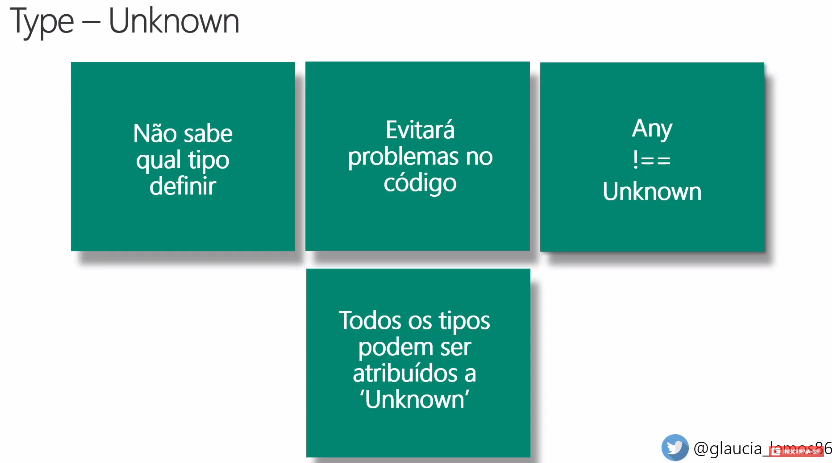

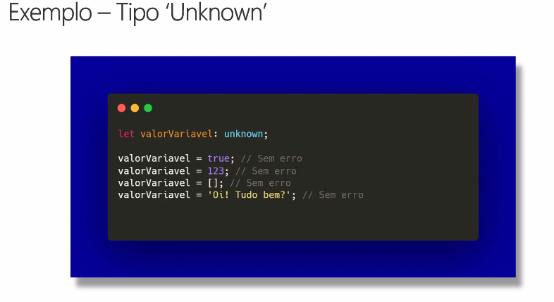

<p>nunca atribua o valor unknown algo que ja tem uma inferencia de outro tipo </p> 

<p>isso pode dar erro. exemplo abaixo</p>

````ts
let valor: unknown;

let valor1: boolean = valor;

console.log(valor1);

````

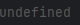

### diferença entre unknown e any

````ts
let algumacoisaAny: any;
let algumacoisaUnknown: unknown;

console.log(algumacoisaAny.toFixed(2));
console.log(algumacoisaUnknown.toFixed(2));
````

<p>Como mostrado na imagem abaixo somente o unknown esta mostrando que contem erro, 
ja o any não, por que ele nao vai te mostrar um erro em tempo de execução</p>

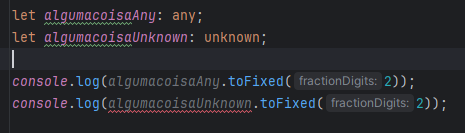