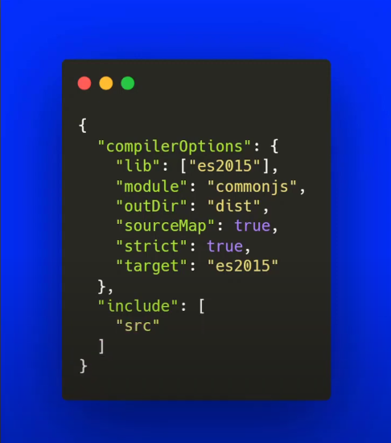
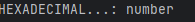
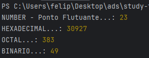
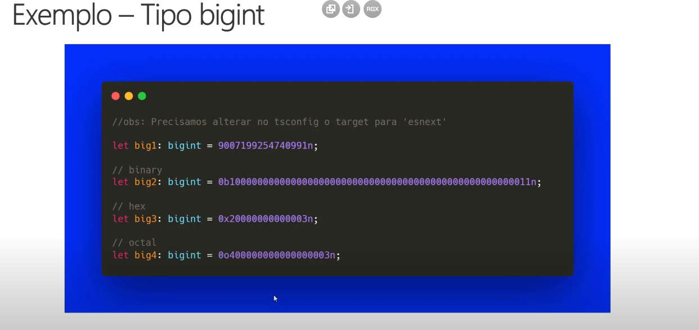
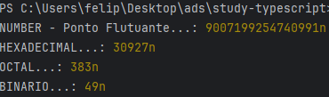

# study-on-typescript

# tsconfig.json



### include
<p>o include é as pastas onde o tsc deve procurar para encontrar seus arquivos typescript</p>

### lib
<p>representa que tipo que o tsc deve executar seu codigo</p>

### molude
<p>para qual sistema de module que o tsc deve compilar o seu codigo</p>

## hello wordl

````typescript

let mensagem: string = 'hello wordl';// definindo a variavel e o tipo dela

console.log(mensagem);
````

## utilizando function e chamando-a

````typescript
function addnumber(numb1 : number, numb2 : number)
{
    return numb1 + numb2;
}
console.log(addnumber(1,1));
````

### typeof

<p> para saber que tipo de dados está querendo saber</p>

````ts
console.log('HEXADECIMAL...:', typeof (numb2));
````



## Exemplos de como usar number em ts

````ts
let numb1:number = 23.0;
let numb2:number = 0x78CF;
let numb3:number = 0o577;
let numb4:number = 0b110001;

console.log('NUMBER - Ponto Flutuante...:', numb1);
console.log('HEXADECIMAL...:', numb2);
console.log('OCTAL...:', numb3);
console.log('BINARIO...:', numb4);
````

### Saida



## BIGINT



<p>para sinalizar que é um numero grande, todo final do conteudo vai um (n) para indicar que é um bigint</p>

````ts
let numbBig1:bigint = 9007199254740991n;
let numbBig2:bigint = 0x78CFn;
let numbBig3:bigint = 0o577n;
let numbBig4:bigint = 0b110001n;

console.log('NUMBER - Ponto Flutuante...:', numbBig1);
console.log('HEXADECIMAL...:', numbBig2);
console.log('OCTAL...:', numbBig3);
console.log('BINARIO...:', numbBig4);
````

### Saida 



<p>bigInt é diferente de number, eles sao tipos primitios que lidam com numeros 
completamentes distintos, por exemplo se for uma aplicação que lida com valores
você irá utilizar o bigInt, e se não for numeros não tão expressivos você irá
utilizar o number</p>