# study-on-typescript

# tsconfig.json

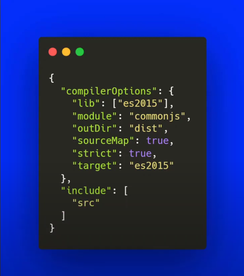

### include
<p>o include é as pastas onde o tsc deve procurar para encontrar seus arquivos typescript</p>

### lib
<p>representa que tipo que o tsc deve executar seu codigo</p>

### molude
<p>para qual sistema de module que o tsc deve compilar o seu codigo</p>

## hello world

````typescript

let mensagem: string = 'hello world';// definindo a variavel e o tipo dela

console.log(mensagem);
````

## utilizando function e chamando-a

````typescript
function addnumber(numb1 : number, numb2 : number)
{
    return numb1 + numb2;
}
console.log(addnumber(1,1));
````

### typeof

<p> para saber que tipo de dados está querendo saber</p>

````ts
console.log('HEXADECIMAL...:', typeof (numb2));
````

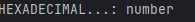

## Exemplos de como usar number em ts

````ts
let numb1:number = 23.0;
let numb2:number = 0x78CF;
let numb3:number = 0o577;
let numb4:number = 0b110001;

console.log('NUMBER - Ponto Flutuante...:', numb1);
console.log('HEXADECIMAL...:', numb2);
console.log('OCTAL...:', numb3);
console.log('BINARIO...:', numb4);
````

### Saida

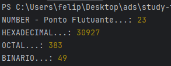

## BIGINT

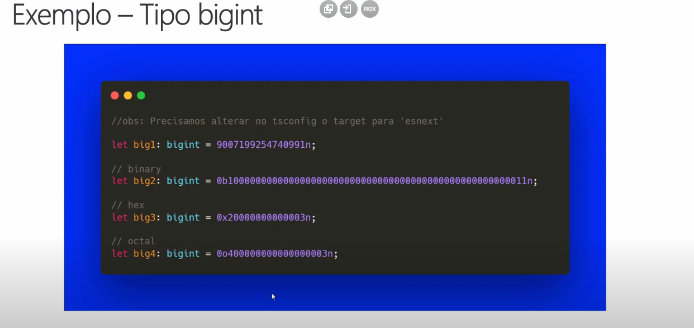

<p>para sinalizar que é um numero grande, todo final do conteudo vai um (n) para indicar que é um bigint</p>

````ts
let numbBig1:bigint = 9007199254740991n;
let numbBig2:bigint = 0x78CFn;
let numbBig3:bigint = 0o577n;
let numbBig4:bigint = 0b110001n;

console.log('NUMBER - Ponto Flutuante...:', numbBig1);
console.log('HEXADECIMAL...:', numbBig2);
console.log('OCTAL...:', numbBig3);
console.log('BINARIO...:', numbBig4);
````

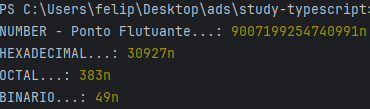

<p>bigInt é diferente de number, eles sao tipos primitios que lidam com numeros 
completamentes distintos, por exemplo se for uma aplicação que lida com valores
você irá utilizar o bigInt, e se não for numeros não tão expressivos você irá
utilizar o number</p>

## UTILIZANDO STRING 

````ts
let nomePessoa : string = 'felipe';
let nomecompleto : string = `Seja bem vindo ${nomePessoa}`;
console.log(nomecompleto);
````

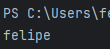

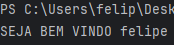

## UTILIZANDO ARRAY'S

````ts
let frutas:Array<string> = ['maça','banana','abacaxi'];

console.log(frutas);
````


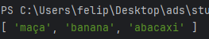

### push

<p>ele inseri um novo elemento no fim da array</p>

````ts
let idiomas: Array<string> = ['portugues','ingles','espanhol','frances'];

idiomas.push('mandarim');

console.log(idiomas);
````

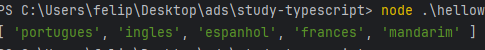

### VER O TAMANHO DA ARRAY

````ts
let idiomas: Array<string> = ['portugues','ingles','espanhol','frances'];

console.log(idiomas.length);
````

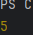

### spread operator

````ts
let listaNumeros: Array<number> = [0,1,2,3,4,5];
listaNumeros = [...listaNumeros,6,7,8,9];
````

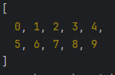

## UTILIZANDO FUNCTION E FOR

````ts
let linguagem: Array<string> = ['python','php','ts','c#'];

function funcaoLinguagem(linguagens:Array<string>) {
    for (let i = 0; i < linguagens.length; i++) {
        console.log(linguagens[i]);
    }
}

funcaoLinguagem(linguagem);
````
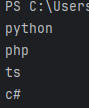

## UTILIZANDO TUPLAS

````ts
let pessoa1: [string, string, number];
pessoa1 = ['felipe', 'mateus', 26];
console.log(pessoa1);
````

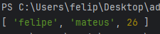

## TUPLAS COM LABELS

````ts
let pessoa1: [nome:string, sobrenome:string, idade:number] = ['felipe', 'mateus', 26];
````

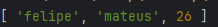

## SPREAD OPERATOR COM TUPLAS

````ts
let listaFrutas: [string, ...string[]] = ['maça','banana','abacaxi'];
console.log(...listaFrutas);
````

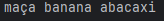

## TUPLAS COM FUNÇÕES

````ts
function listarPessoas(nomes: string[],idades:number[]):(string | number)[] {
    return [...nomes, ...idades];
}
let resultado = listarPessoas(['felipe','regina'],[26,19]);

console.log(resultado);
````

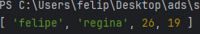

## LABELED TUPLES COM SPREAD OPERATOR NUMA FUNÇÃO

````ts
type Nome = | [primeiroNome: string, sobrenome:string]
    | [primeiroNome: string, nomeMeio:string ,sobrenome:string];

function criarPessoa(...nome:Nome){
    return [...nome];
}

console.log(criarPessoa('felipe','mateus'));
````

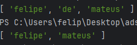

## ENUMS

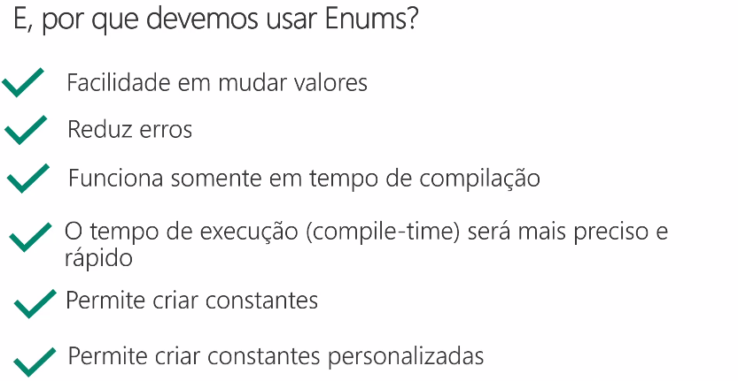

````ts
enum Idioma {
    Portugues,
    Espanhol,
    Ingles,
    Frances
}
console.log(Idioma);
````

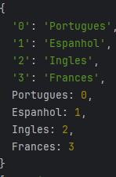

````ts
enum Idioma {
    Portugues = 'PT-BR',
    Espanhol = 'ES',
    Ingles = 'EN',
    Frances = 'FR'
}
console.log(Idioma.Portugues);
````

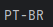

### EXEMPLO 2

````ts
enum Tarefa {
    Todo,
    Progress,
    Done,
}

const concluidaTarefa = {
    id : 1,
    status: Tarefa.Done,
    descricao: 'Parabens! Tarefa concluida com sucesso!',
};

if (concluidaTarefa.status === Tarefa.Done) {
    console.log('Enviar e-mail: Tarefa Concluida!');
}
````
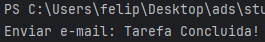

## ANY EM TS

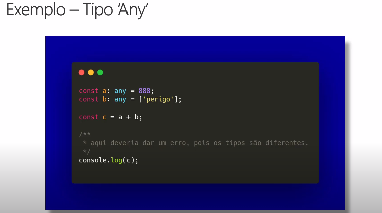

<p>o certo é saber quando usar o any, ao utilizar ele de qualquer jeito pode acontecer varios poblemas
como este no exemplo acima, quando voce não coloca um tipo para sua variavel, ele vai vir como padrão any</p>

````ts
const formulario: {[campoFormulario:string]:any} = {
    nome: 'felipe',
    sobrenome: 'mateus',
    idade: 26,
}

console.log(formulario.campoFormulario);
````
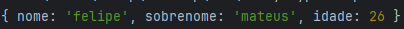

## unknown

<p>Se não souber qual tipo colocar o melhor 
é colocar unknown</p>

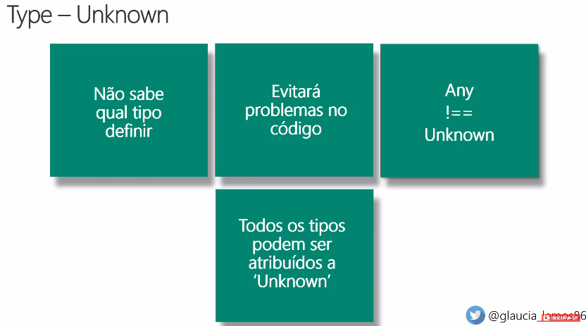

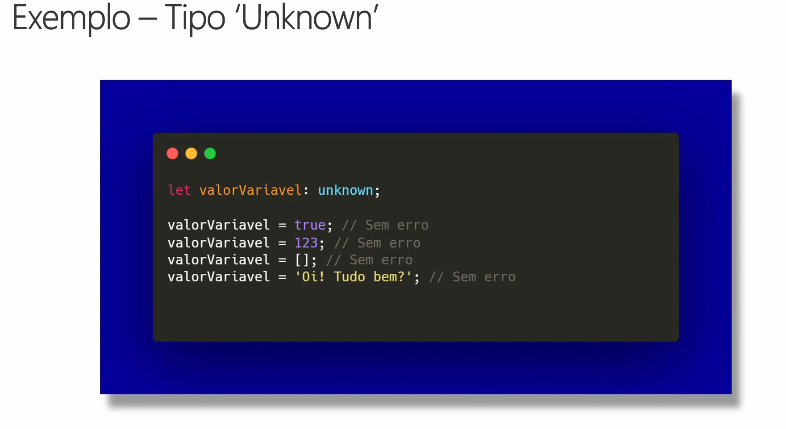

<p>nunca atribua o valor unknown algo que ja tem uma inferencia de outro tipo </p> 

<p>isso pode dar erro. exemplo abaixo</p>

````ts
let valor: unknown;

let valor1: boolean = valor;

console.log(valor1);

````

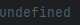

### diferença entre unknown e any

````ts
let algumacoisaAny: any;
let algumacoisaUnknown: unknown;

console.log(algumacoisaAny.toFixed(2));
console.log(algumacoisaUnknown.toFixed(2));
````

<p>Como mostrado na imagem abaixo somente o unknown esta mostrando que contem erro, 
ja o any não, por que ele nao vai te mostrar um erro em tempo de execução</p>

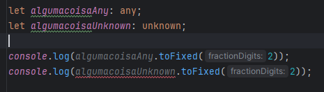

## VOID EM TS

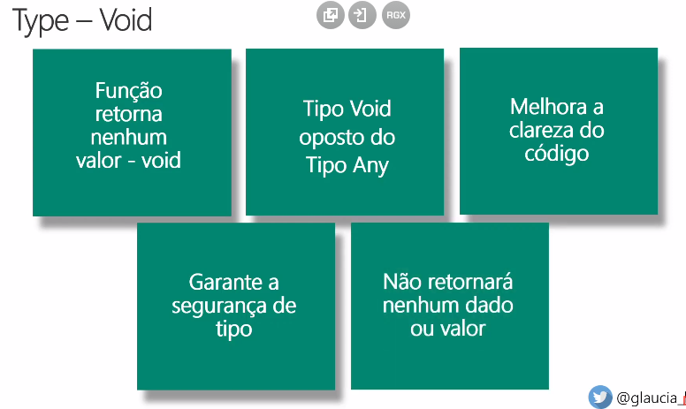

### exemplos

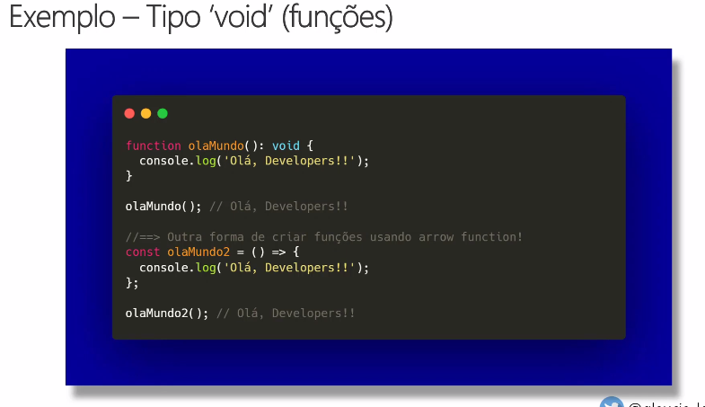

````ts
function logError(errorMessage:string) {
    console.log(errorMessage);
    // return errorMessage;
}
logError('Required field - name!');

// segunda forma
const logErrorExample2 = (errorMessage : string) => {
    console.log(errorMessage);
}
logErrorExample2('Required field - SurName!');
````

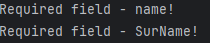

### uso do void em variaveis

<p>quando desativamos o strictNullChecks podemos 
fazer atribuições de variaveis em um valor null em um tipo void</p>

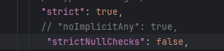

````ts
let variavelExemploVoid: void;
variavelExemploVoid = 1; //error
variavelExemploVoid = null;
variavelExemploVoid = undefined;

console.log(variavelExemploVoid);
````

## NULL E UNDEFINED EM TS

### NULL
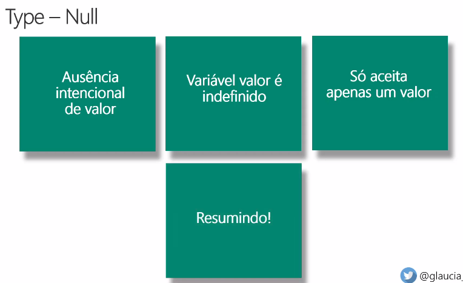

### UNDEFINED
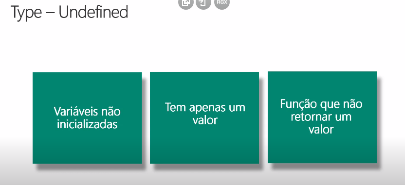

### DIFERENÇA ENTRE ELES

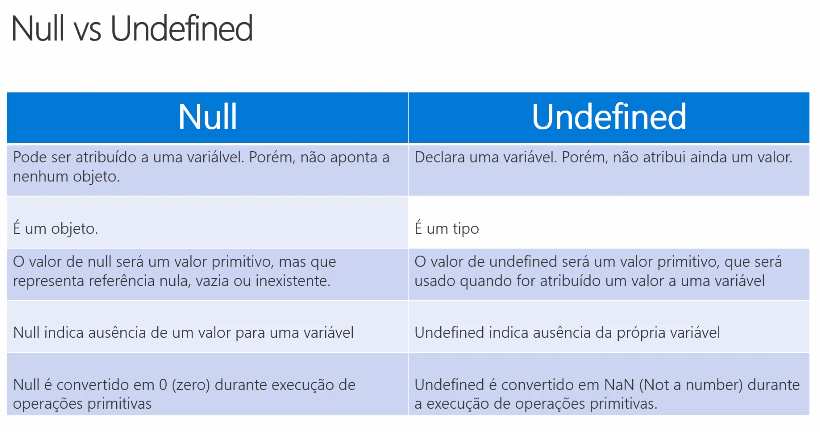

#### null

````ts
let variavelTestNull = null;
console.log(variavelTestNull);
console.log(typeof variavelTestNull);
````
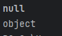

#### undefined

````ts
let variavelTesteUndefied;
console.log(variavelTesteUndefied);
console.log(typeof variavelTesteUndefied);
````
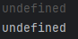

#### diferença entre os 2

````ts
// == compara resultado, === compara valor e o tipo
// console.log('exemplo 1:', null == undefined);
// console.log('exemplo 2:', null === undefined);
````
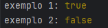

## NEVER EM TS

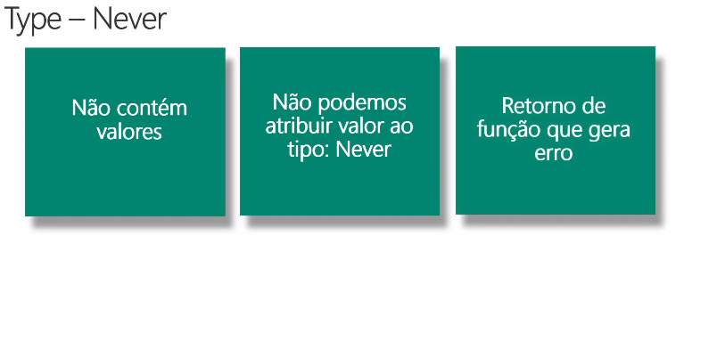

````ts
function error(message:string) : never {
    throw new Error(message);
}
console.log(error('erro de mensagem'));

function rejectMessage() : never {
    return error('Error de mensagem - 02');
}

console.log(rejectMessage());

const loopInfinity = function loop(){
    while (true){
        console.log('oi');
    }
};

console.log(loopInfinity());
````

## OBJECT EM TS

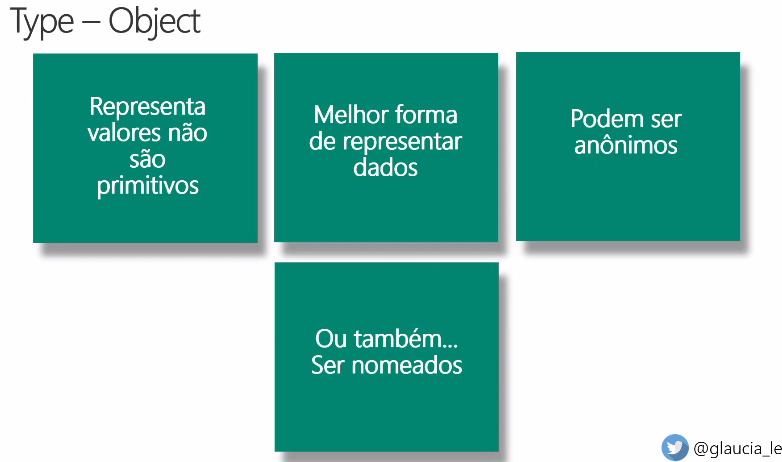

````ts
const pessoa12 = {
    nome: 'felipe',
    sobrenome: 'mateus',
    idade: 26,
    funcao: 'developer php',
}

function onboarding01(funcionario: { nome:string }) : string {
    return 'seja bem vindo ' + funcionario.nome;
}

console.log(onboarding01({nome:' felipe mateus'}));
````

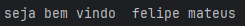

#### utilizando interface com Objeto

````ts
interface Pessoa {
    nome: string;
    funcao: string;
}

function onboarding02(pessoa:Pessoa): string {
    return (
        'Seja bem vindo: ' + pessoa.nome + ' sua funcao aqui na empresa sera: ' + pessoa.funcao
    )
}

console.log(onboarding02({nome: 'felipe',funcao:'developer php'}));
````
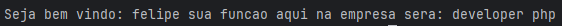

#### utilizando type com Object

````ts
type Pessoa03 = {
    nome: string;
    funcao: string;
    linguagem:string;
};

function onboarding03(pessoa:Pessoa03): string {
    return (
        'Seja bem vindo: ' + pessoa.nome + ' sua funcao aqui na empresa sera: '
        + pessoa.funcao + ' voce trabalhara com a linguagem :' + pessoa.linguagem
    )
}

console.log(onboarding03({nome: 'felipe',funcao:'developer php', linguagem:'php'}));
````
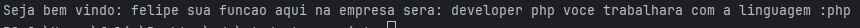

#### propriedade opcional (?:)

````ts
interface Pessoa04 {
 nome: string;
 funcao: string;
 linguagem:string;
 email?:string;
}

function onboarding04(pessoa:Pessoa04): string {
    return (
        'Seja bem vindo: ' + pessoa.nome + ' sua funcao aqui na empresa sera: '
        + pessoa.funcao + ' voce trabalhara com a linguagem :' + pessoa.linguagem
    )
}

console.log(onboarding04({nome: 'felipe',funcao:'developer php', 
    linguagem:'php',email:'dsadas'}));
````

## HERANÇAS EM TYPESCRIPT

````ts
interface Mae{
    nome:string;
}

interface Pai{
    sobrenome:string;
}

interface Filho extends Mae, Pai{
    idade:number;
}

const filho: Filho = {
    nome: 'Felipe',
    sobrenome: 'Mateus',
    idade:26
}

console.log(filho);
````

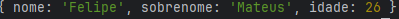

## GENERICS IN TS

````ts
type Usuario = {
    nome: string;
    email:string;
}

type Admin = {
    nome: string;
    email: string;
    admin: true;
}

const usuario: Usuario = {
    nome: 'Felipe',
    email: 'fe@gmail.com'
}

const admin: Admin = {
    nome: 'Felipe',
    email: 'fe@gmail.com',
    admin: true
}

function acessarSistema<T>(usuario:T):T{
    return usuario;
}

console.log(acessarSistema<Usuario>(usuario));
console.log(acessarSistema<Admin>(admin));
````

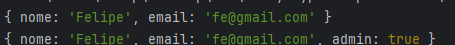

## IF IN TS

````ts
let desconto : number;
let valorCompra = 14;

if (valorCompra > 0 && valorCompra <= 5 ){
    desconto = 5;
}else if (valorCompra > 5 && valorCompra <= 10){
    desconto = 10;
}else {
    desconto = 15;
}
````

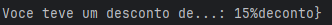

### ternario

````ts
const podeVotar = (idadeVotacao >= 18)
    ? 'voce é elegivel para votar'
    : 'voce nao é elegivel para votar'

console.log(podeVotar);
````

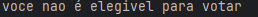

## FUNCTIONS IN TS

````ts
function somarNumeros(number1: number, number2: number) : number{
    return number1 + number2;
}
````


#### FUNCTION ANONIMO

````ts
const saudar = function (mensagem: string) : string{
    return mensagem;
};
````
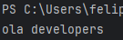

#### FUNCTION ARROW 

````ts
const saudar02 = (mensagem : string) : string =>{
    return mensagem;
}
````
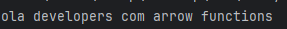

#### FUNCTION CONSTRUCTOR

````ts
const saudar03 = new Function('mensagem', 'return "Fala " + mensagem');
````

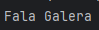

## OPTIONAL PARAMETERS IN TS

````ts
function informarDadosPessoas(idPessoa: number, nome: string, email?:string) : void{
    if (email != undefined){
        console.log('Id Funcionario: ', idPessoa, 'Nome: ', nome,
            'Email: ', email);
        return;
    }
    console.log('Id Funcionario: ', idPessoa,'Nome: ', nome);
}

informarDadosPessoas(1,'Felipe',);
informarDadosPessoas(2,'gilmara','gilmara@gmail.com');
````

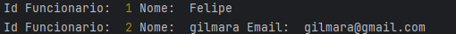

````ts
function mensagemLog(mensagem : string, usuarioId ?: number) : void{
    const horaLog = new Date().toLocaleTimeString();

    console.log(horaLog, mensagem, usuarioId || 'Usuario(a) não conectado(a)');
}

mensagemLog('atualizar pagina');
mensagemLog('usuario logado com sucesso!!',778811);
````

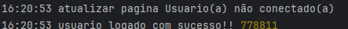

````ts
type Pessoa15 = {
    IdFuncionario: number;
    nome: string;
    idade?: number;
    email?: string;
}

let pessoa15 : Pessoa15;

pessoa15 = {
    IdFuncionario: 1,
    nome: 'Felipe',
};

console.log(pessoa15);
````

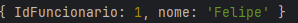

## DEFAULT PARAMETERS

````ts
function exibirMensagem(mensagem : string, saudar = 'fala pessoal') : string {
    return saudar + ' ' + mensagem + '!';
}
````
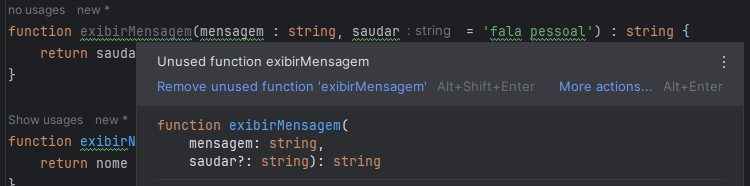

## REST PARAMETERS

````ts
function somarNumeros2(...numeros : number[]){
    let total = 0;
    numeros.forEach((numero : number) => (total += numero));
    return total;
}

console.log(somarNumeros2(1,2,3));
````
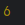

````ts
function listarFrutas(frase : string, ...frutas : string[]){
    return frase + ' ' + frutas.join(', ');
}
````

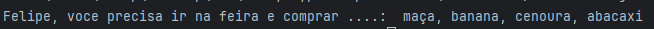

### with class

````ts
class Produtos{
    public exibirProdutos(...produtos : string[]):void{
        for(const produto of produtos){
            console.log(produto);
        }
    }
}

const departamentoInformatica : Produtos = new Produtos();
console.log('todos os produtos do departamento de informatica disponivel no estoque...:');

departamentoInformatica.exibirProdutos('mouse', 'notebook', 'usb', 'teclado', 'webcam');
````


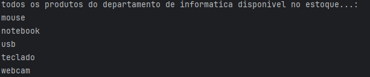

## Class in ts

````ts
class Estudante01{
    codigoEstudante : number;
    nome : string;

    constructor(nome : string, codigoEstudante : number) {
        this.nome = nome;
        this.codigoEstudante = codigoEstudante;
    }
    listarEstudante(){
        console.log('Codigo: ' + this.codigoEstudante);
        console.log('nome: ' + this.nome);
    }
}

const estudante1 = new Estudante01('felipe',11);

estudante1. listarEstudante();
````

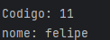

### not constructor

````ts
class Estudante{
    codigoEstudante : number;
    nome : string;
}

const estudante = new Estudante();

estudante.codigoEstudante = 123;
estudante.nome = 'felipe';

console.log('codigo do estudante: ' + estudante.codigoEstudante);
console.log('nome do estudante: ' + estudante.nome);
````

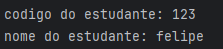

## MODIFICADORES DE ACESSO

#### private
````ts
class Estudante52 {
    codigoEstudante : number;
    nomeEstudante : string;
    private idade : number;

    constructor(codigo : number, nome : string, idade : number) {
        this.codigoEstudante = codigo;
        this.nomeEstudante  = nome;
        this.idade  = idade;
    }

    retornarDadosEstudantes() {
        return `codigo: ${this.codigoEstudante} | 
        nome: ${this.nomeEstudante} | 
        idade: ${this.idade}`;
    }
}

const estudante52 = new Estudante52(
    1,
    'felipe',
    26
);

console.log(estudante52.retornarDadosEstudantes());
````
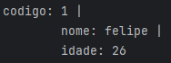

#### protected

````ts
class Estudante53 {
    codigoEstudante : number;
    protected nomeEstudante : string;

    constructor(codigo : number, nome : string) {
        this.codigoEstudante  = codigo;
        this.nomeEstudante  = nome;
    }
}

class Pessoa101 extends Estudante53{
    private curso : string;

    constructor(codigo : number, nome : string, curso : string) {
        super(codigo, nome);
        this.curso = curso;
    }

    retornarDadosAluno() {
        return `codigo: ${this.codigoEstudante} | 
        nome: ${this.nomeEstudante} | 
        curso: ${this.curso}`;
    }
}

const estudante102 = new Pessoa101(1,'felipe','ads');
console.log(estudante102.retornarDadosAluno());
````
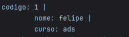

## readonly in ts

````ts
class Funcionario {
    readonly dateNascimento : Date;

    constructor(dataNascimento : Date) {
        this.dateNascimento = dataNascimento
    }
}

const funcionario = new Funcionario(new Date(1997,12,19));
// funcionario.dateNascimento = new Date(1997,12,19) error
````
#### outra forma de utilizar o readonly

````ts
class Funcionario01 {
    constructor(readonly dataNascimento: Date) {
        this.dataNascimento = dataNascimento;
    }
}
````
## readonly with interface 

````ts
interface IFuncionario {
    codigo : number;
    nome : string;
}

const funcionario03:Readonly<IFuncionario> = {
    codigo : 1,
    nome: 'mario',
}

funcionario03.codigo = 23;
funcionario03.nome = 'felipe';

// acessando sem o readonly
const funcionario04: IFuncionario = {
    codigo : 1,
    nome: 'mario',
}
````

## GET AND SET IN TS

````ts
class Estudante1245 {
     _nome: string;
     _semestre : number;
     _curso : string;

    constructor(nome : string, semestre : number, curso : string) {
        this._nome = nome;
        this._semestre  = semestre;
        this._curso = curso;
    }

    get cursos(){
        return this._curso;
    }

    set cursos(setCurso : string){
        this._curso = setCurso;
    }
}

const estudante54 = new Estudante1245('felipe',5,'ads');
console.log(estudante54)
estudante54._curso = 'sistema da informação';
console.log(estudante54);
````

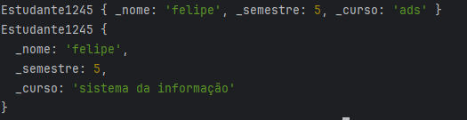

## HERANÇA IN TS

````ts
class Animal01{
    mover(distancia = 0){
        console.log(`Animal se moveu...: ${distancia} mestros.`);
    }
}

class Cachorro extends Animal01{
    latir(){
        console.log('Au, Au');
    }
}

const cao = new Cachorro();
cao.mover(5);
cao.latir();
````
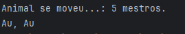

````ts
class Pessoa97{
    constructor(
        private nome: string, private sobrenome: string
    ) {
        this.nome = nome;
        this.sobrenome = sobrenome;
    }

    retornarNomeCompleto(){
        return `${this.nome} ${this.sobrenome}`;
    }

    apresentarPessoa(){
        return `Meu nome é ${this.nome} ${this.sobrenome}.`;
    }
}

class Funcionario97 extends Pessoa97{
    constructor(nome: string, sobrenome: string, private funcao : string){
        super(nome, sobrenome);
    }

    retornarNome02():string{
        return super.apresentarPessoa() + `E, Sou ${this.funcao}.`;
    }
}

const func97 = new Funcionario97('felipe','mateus','ti');
 console.log(func97.retornarNomeCompleto());
 console.log(func97.apresentarPessoa());
 console.log(func97.retornarNome02());
````
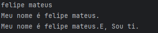

## STATIC IN TS

````ts
class Funcionario98{
    static contratacoes = 0;
    constructor(
        private nome: string,
        private sobrenome: string,
        private titulo: string,
    ) {
        Funcionario98.contratacoes++;
    }
}

const func98 = new Funcionario98('felipe','mateus','dev');
const func99 = new Funcionario98('mario','mateus','prof');

console.log(Funcionario98.contratacoes);
````

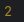

````ts
class Funcionario99{
    private static contratacoes = 0;
    constructor(
        private nome: string,
        private sobrenome: string,
        private titulo: string,
    ) {
        Funcionario99.contratacoes++;
    }

    public static retornarContratacoes(){
        return Funcionario99.contratacoes;
    }
}

const func999 = new Funcionario99('felipe','mateus','dev');
console.log(Funcionario99.retornarContratacoes());
````
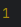

````ts
type Raca = 'spitz' | 'buldogue' | 'pug' | 'yorkshire' | 'poodle';

class Cachorro1{
    public nome : string;
    public idade : number;
    public racas : Raca[];
    public static QTD_CACHORRO_VENDIDO = 0;

    constructor(nome : string, idade : number, racas : Raca[]) {
        this.nome = nome;
        this.idade = idade;
        this.racas = racas;

        Cachorro1.QTD_CACHORRO_VENDIDO++
        console.log(Cachorro1.QTD_CACHORRO_VENDIDO);
    }
    public exibirInformacao():void{
        console.log(`O cachorro ${this.nome} tem ${this.idade}.`);
    }
}

const cao1 = new Cachorro1('bidu',9,['spitz']);
const cao2 = new Cachorro1('guri',7,['buldogue']);
cao1.exibirInformacao();
cao2.exibirInformacao();
````
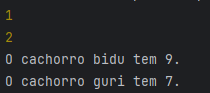

## CLASS ABSTRACT

````ts
abstract class Funcionario999{
    constructor(private nome : string, private sobrenome: string) {}
    abstract retornarSalario(): number;

    get retonarNomeCompleto() : string {
        return `${this.nome} ${this.sobrenome}`;
    }

    emitirContraCheque() : string {
        return `${this.retonarNomeCompleto} - Salario:  ${this.retornarSalario()}`;
    }
}

class FuncionarioCLT extends Funcionario999{

    constructor(nome : string, sobrenome : string, private salario : number) {
        super(nome, sobrenome);
    }

    retornarSalario(): number {
        return this.salario;
    }
}

class FuncionarioPJ extends Funcionario999{
    constructor(nome : string,
                sobrenome : string,
                private valorHora : number,
                private horasTrabalhadas : number) {
        super(nome, sobrenome);
    }

    retornarSalario(): number {
        return this.valorHora * this.horasTrabalhadas;
    }
}

const felipe = new FuncionarioCLT('felipe','mateus',15000);
const renata = new FuncionarioPJ('renata','martiz',150,150);

console.log(felipe.emitirContraCheque());
console.log(renata.emitirContraCheque());
````
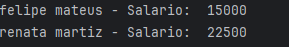

## INTERFACES IN TS

````ts
interface Pessoa{
    nome: string;
    sobrenome: string;
    idade: number;
}

function exibirNome232(pessoa: { idade: number; nome: string; sobrenome: string }){
    return `
    nome: ${pessoa.nome}
    sobrenome: ${pessoa.sobrenome}
    idade: ${pessoa.idade}`;
}

const felipe97 = {
    nome : 'felipe',
    sobrenome : 'mateus',
    idade : 26
}

console.log(exibirNome232(felipe97));
````
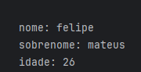

````ts
interface Livro{
    titulo : string;
    autor : string;
    paginas ?: number;
}

const livro : Livro = {
    titulo : 'O senhor dos aneis',
    autor : 'romario biro'
}

console.log(livro);
````
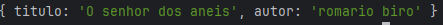

````ts
interface Carro{
    readonly modelo : string;
    ano : number;
    valor ?: number;
}

const carro : Carro = {
    modelo : 'Fusca',
    ano : 1999,
}

console.log(carro);
````
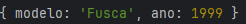

````ts
interface IAnimal {
    nome : string;
    idade : number;
    estaVivo : boolean;
    comer(tipoComida : string) : void;
}

class Gato implements IAnimal{
    estaVivo: boolean;
    idade: number;
    nome: string;

    constructor(nome : string, idade : number, estaVivo : boolean) {
        this.nome = nome;
        this.idade = idade;
        this.estaVivo = estaVivo;
    }
    comer(tipoComida: string): void {
        console.log(`O gato ${this.nome} de ${this.idade} anos está comendo ${tipoComida}`);
    }
}

const gato = new Gato('reiske',3,true);
gato.comer('ração');
console.log(gato);
````
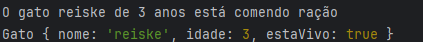

## EXTENDS INTERFACE IN TS

````ts
interface ICachorro{
    nome:string;
}

interface IGato{
    nome: string;
}

interface IAnimal12 extends IGato, ICachorro {
    idade: number;
}

const animal21 : IAnimal12 = {
    nome: 'bidu',
    idade: 10,
}
````
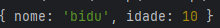

````ts
interface IFuncionario156 {
    id: number;
    nome: string;
    salario: number;
}

//omit para mudar o scopo da propriedade
interface IDesenvolvedor extends Omit<IFuncionario156, 'id'> {
    id:string;
    linguagemProgramacao: string;
}

const desenvolvedor : IDesenvolvedor = {
    id: '1',
    nome: 'felipe',
    salario: 2600,
    languagemProgramacao: 'php',
}
````
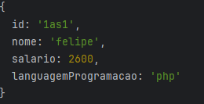

## INTERSECTION TYPES

````ts
interface DadosBancarios{
    conta:number;
    agencia:number;
    banco:string;
}

interface Cliente21321{
    nome:string;
    email:string;
}

interface DadosPessoaFisica {
    cpf:number;
}

type DadosCliente = DadosBancarios & Cliente21321 & DadosPessoaFisica;

const dadosCliente : DadosCliente = {
    conta: 123,
    agencia: 123123,
    banco: 'banco do brasil',
    nome: 'felipe',
    email: 'fe@gmail.com',
    cpf: 132132132,
}
````
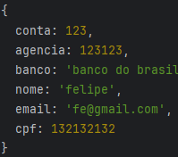

## TYPE GUARDS 

### TYPEOF

````ts
type alfanumerico = string | number;

function exibirTipo(a: alfanumerico, b: alfanumerico) {
    if (typeof a === 'number' && typeof b === 'number'){
        return a + b;
    }

    if (typeof a === 'string' && typeof b === 'string'){
        return a.concat(b);
    }

    throw new Error('Argumentos invalidos');
}

console.log(exibirTipo(20,5));
console.log(exibirTipo('fe,','mateus'));
console.log(exibirTipo('fe,',1));
````

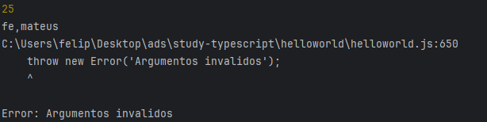

### INSTANCEOF

````ts
class Carro2{
    nome: string;
    marca: string;

    constructor(nome: string, marca: string) {
        this.nome = nome;
        this.marca = marca;
    }
}

class Moto2{
    nome: string;
    ano: number;

    constructor(nome : string, ano: number) {
        this.nome = nome;
        this.ano = ano;
    }
}

function detalhesVeiculos(veiculo: Carro2 | Moto2){
    if (veiculo instanceof Carro2){
        return `O nome do carro é: ${veiculo.nome} e a marca é: ${veiculo.marca}`;
    }else if(veiculo instanceof Moto2){
        return `O nome da mato é: ${veiculo.nome} e o ano é: ${veiculo.ano}`;
    }
}

const carro2 = new Carro2('gol','volksvagen');
const moto2 = new Moto2('CBR',2020);
console.log(detalhesVeiculos(carro2));
console.log(detalhesVeiculos(moto2));
````

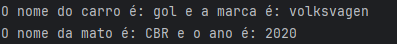

### IN

````ts
interface IAnimal2 {
    grupo: string;
}

class Peixe implements IAnimal2 {
    grupo: string;
    corPeixe: string;

    constructor(grupo: string, corPeixe: string){
        this.grupo = grupo;
        this.corPeixe = corPeixe;
    }
}

class Passaro implements IAnimal2{
    grupo: string;
    corPena: string;

    constructor(grupo: string, corPena: string) {
        this.grupo = grupo;
        this.corPena = corPena;
    }
}

function nadar(grupo: string){
    console.log(`O ${grupo} esta nadando...`);
}

function voar(grupo: string){
    console.log(`O ${grupo} esta nadando...`);
}

function mover(animal: IAnimal2){
    if ('corPeixe' in animal){
        nadar((animal as Peixe).grupo);
    }else if('corPena' in animal){
        voar((animal as Passaro).grupo);
    }
}

mover(new Peixe('peixe', 'azul'));
mover(new Passaro('passaro', 'vermelho'));
````

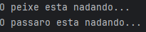

## TYPE CASTING

````ts
const nome: unknown = 'felipe';
console.log((nome as string).toUpperCase());
````
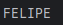

````ts
//segunda forma de usar o type casting
const carro1997: string = 'corolla';

const tamanhoString: number = (<string>carro1997).length;
console.log('o tamanho da string é:',tamanhoString);
````
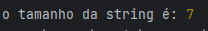

## TYPE ASSERTION

````ts
function exibirPrecoFinal(preco: number, desconto: number, formato: boolean): number | string{
    const precoComdesconto = preco * (1 - desconto);

    return formato ? `R$ ${precoComdesconto}` : precoComdesconto;
}

const descontoFinal =
    exibirPrecoFinal(100, 0.05, true) as string;

const descontoFinal2 =
    <number>exibirPrecoFinal(100, 0.05, false);

console.log(typeof (descontoFinal));
console.log(typeof (descontoFinal2));
````
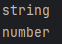

## CONDITIONAL TYPES

````ts
type FormatoArquivos = 'png' | 'jpg'| 'gif' | 'svg' | 'mp4' | 'mp3';

type FiltrarArquivoAudio<T> = T extends 'mp4' | 'mp3' ? T : never;

type ArquivoAudio = FiltrarArquivoAudio<FormatoArquivos>;

const arquivoAudio: ArquivoAudio = 'mp4';

console.log(arquivoAudio);
````
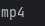

## MAPPEDTYPES


